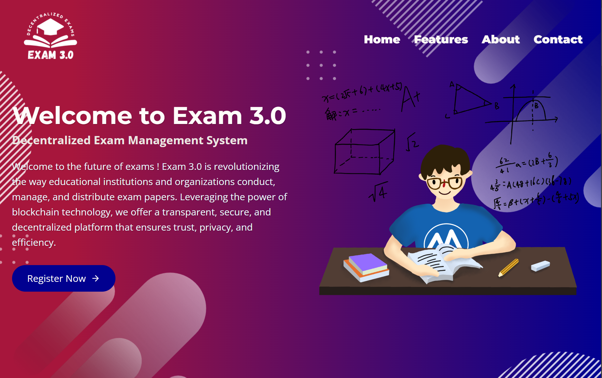
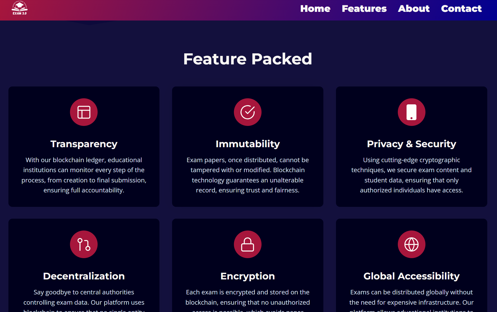

  EXAM 3.0 - README

EXAM 3.0 - Secure Exam Management System
========================================

**EXAM 3.0** is a decentralized, secure, and transparent platform for managing exams. The system ensures exam papers are securely stored on IPFS using the Pinata cloud service and deployed on a private blockchain (using Hardhat). The system automates exam paper access at scheduled times in exam centers using a client application, and candidates can register through the website.

Table of Contents
-----------------

1.  [Project Overview](#project-overview)
2.  [Tech Stack](#tech-stack)
3.  [Features](#features)
4.  [Installation](#installation)
5.  [Smart Contract Deployment](#smart-contract-deployment)
6.  [Frontend Setup](#frontend-setup)
7.  [IPFS and Pinata Integration](#ipfs-and-pinata-integration)
8.  [Database and WordPress Integration](#database-and-wordpress-integration)
9.  [Screenshots](#screenshots)
10.  [Contributing](#contributing)
11.  [License](#license)

Project Overview
----------------

**EXAM 3.0** aims to provide an end-to-end secure exam system:

*   Exam papers are uploaded by the admin and stored in IPFS.
*   Papers are revealed only at the scheduled exam time.
*   The system supports user registration through the website (built with React and Next.js) and WordPress integration.
*   Exam details, such as the time, center, and other information, are stored in MySQL and accessible via a user portal.

Tech Stack
----------

*   **Blockchain Framework**: Hardhat (Local Private Blockchain)
*   **Frontend**: React.js, Next.js
*   **Smart Contracts**: Solidity
*   **Blockchain Interaction**: Ethers.js
*   **Storage**: IPFS via Pinata Cloud Service
*   **Database**: MySQL
*   **CMS Integration**: WordPress

Features
--------

1.  **Decentralized Exam Paper Storage**: Exam papers are securely uploaded and stored on IPFS, ensuring tamper-proof exam distribution.
2.  **Time-based Exam Paper Reveal**: Papers are automatically displayed to candidates at the scheduled time.
3.  **User Registration**: Users can register through the website and WordPress, providing their public address for exam access.
4.  **Exam Information Portal**: Candidates can view their exam details (exam center, timing, etc.) via the portal.
5.  **Client Software for Exam Centers**: Custom client software will automatically display exam papers at exam centers.

Installation
------------

Follow these steps to set up the project on your local machine.

### Prerequisites

Ensure you have the following installed:

*   [Node.js](https://nodejs.org/)
*   [Hardhat](https://hardhat.org/)
*   [MySQL](https://www.mysql.com/)
*   [Pinata Account](https://www.pinata.cloud/)

### 1\. Clone the Repository

   https://github.com/arifakhtar51/HackIndia-Spark-7-priority_queue.git
    cd HackIndia-Spark-7-priority_queue
    

### 2\. Install Dependencies

    npm install

Smart Contract Deployment
-------------------------

### 1\. Hardhat Setup

Run the following command to start the Hardhat local blockchain:

    npx hardhat node

### 2\. Deploy Contracts

In another terminal, deploy the contracts:

    npx hardhat run scripts/deploy.js --network localhost

### 3\. View Deployed Contract

You can view the deployed contract address in the `./scripts/deploy.js` file and interact with the contract using `ethers.js`.

Frontend Setup
--------------

1\. **React and Next.js Configuration**: The frontend is built using Next.js to ensure SEO optimization and server-side rendering. Customize the user experience by updating the components in the `./pages` directory.

2\. Run the Frontend:

    npm run dev

The application will run on `http://localhost:3000`.

### User Portal

Users can log in, register, and view their exam-related information on the portal. The portal fetches data from MySQL using a REST API.

**Screenshot**: User Portal displaying exam details

IPFS and Pinata Integration
---------------------------

### 1\. Setup Pinata API

*   Create an account on [Pinata](https://www.pinata.cloud/).
*   Get your **API Key** and **Secret Key** from the Pinata dashboard.
*   Update the `.env` file with the Pinata keys:

    PINATA_API_KEY=your_pinata_api_key
    PINATA_SECRET_API_KEY=your_pinata_secret_key
    

### 2\. Upload Exam Papers to IPFS

Admins can upload exam papers via the admin panel, which will automatically pin the files to IPFS using the Pinata cloud service.

**Screenshot**: Admin panel for uploading exam papers to IPFS

Database and WordPress Integration
----------------------------------

### 1\. MySQL Setup

Set up a MySQL database on your local machine or use a cloud-based MySQL service. Configure the MySQL connection in the `.env` file:

    MYSQL_HOST=localhost
    MYSQL_USER=root
    MYSQL_PASSWORD=your_password
    MYSQL_DB=exam_3_0
    

### 2\. WordPress Integration

WordPress is used for content management, allowing users to register via WordPress and manage their profiles. Ensure the necessary WordPress plugins are installed and the MySQL database is synced for smooth integration.

**Screenshot**: WordPress integration for user registration

Screenshots
-----------

*   **User Registration Page**: 
*   
*   
*   **Admin Panel for Paper Upload**: 
*   **User Portal with Exam Details**: 
*   **Exam Paper Display during Exam Time**: 
